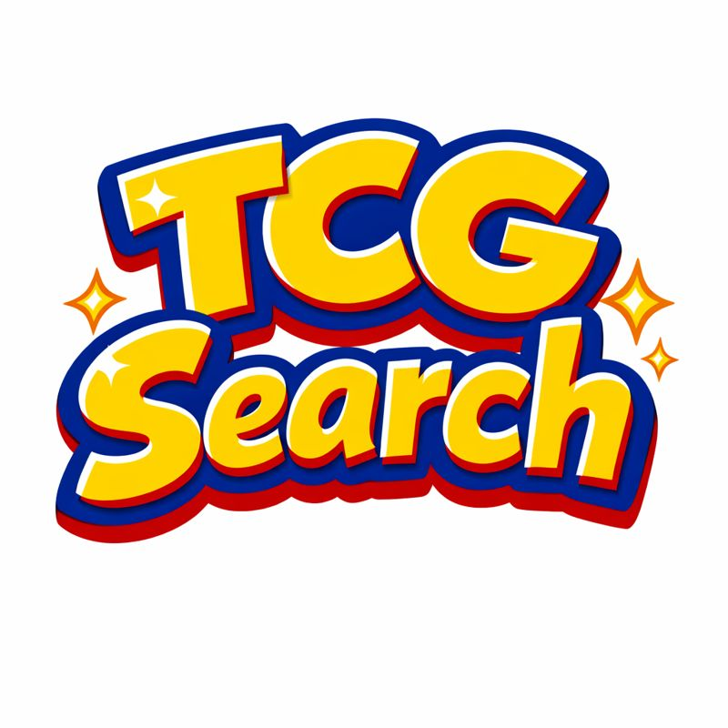

<p align="center">
  
</p>

# TCG Search

A Pokemon Trading Card Game search application built with React InstantSearch v7, featuring Algolia's search analytics and Agent Studio Chat integration. This demo showcases how to build a modern search experience with conversational AI, complete with view, click, and conversion event tracking.

## Features

- **InstantSearch Interface**: Full-featured search with filters for set, type, and rarity
- **Agent Studio Chat**: Conversational search powered by Algolia's Agent Studio
- **Search Analytics**: Comprehensive event tracking (views, clicks, conversions)
- **Responsive Design**: Mobile-first UI optimized for all devices
- **Card Details**: Individual Pokemon card pages with conversion tracking

## Quick Start

```bash
npm install
npm start
```

The app will run at `http://localhost:3000`

## Available Scripts

- `npm start` - Start development server
- `npm run build` - Build for production
- `npm run test` - Run tests
- `npm run lint` - Run ESLint
- `npm run publish` - Build and deploy to Vercel

## Architecture

Built with:
- **React InstantSearch v7**: Modern search UI framework
- **Algolia Search**: Powering the search experience
- **Agent Studio**: Conversational search integration
- **React Router**: Client-side routing
- **search-insights**: Analytics event tracking

## Configuration

Create a `.env` file with:

```
REACT_APP_ALGOLIA_APP_ID=your_app_id
REACT_APP_ALGOLIA_API_KEY=your_api_key
REACT_APP_ALGOLIA_INDEX_NAME=pokemon-cards
REACT_APP_USER_TOKEN=your_user_token

# Optional: Sorting with virtual replicas
# If not set, defaults to ${REACT_APP_ALGOLIA_INDEX_NAME}_price_asc and _price_desc
REACT_APP_ALGOLIA_INDEX_NAME_PRICE_ASC=pokemon-cards_price_asc
REACT_APP_ALGOLIA_INDEX_NAME_PRICE_DESC=pokemon-cards_price_desc

# Optional: Segment analytics
REACT_APP_SEGMENT_WRITE_KEY=your_segment_key
```

## Documentation

See [CLAUDE.md](./CLAUDE.md) for detailed architecture and development guidelines.

